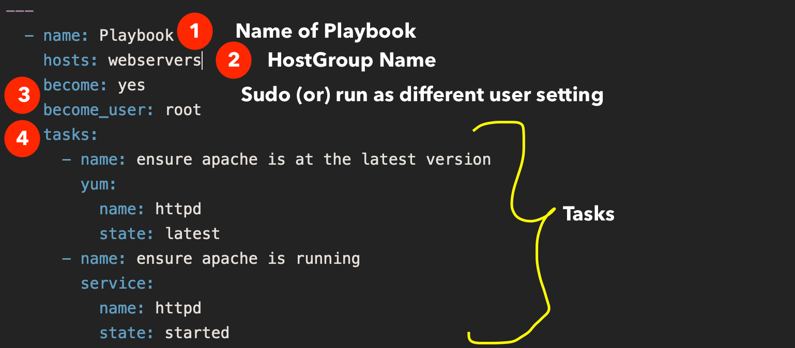

# Ansible
- Open-souroce automation tool
    - Server **Config management**
    - **App deployment** (and updates), including database and environment variable configurations
    - **Orchestration**, automating multi-step processes across machines (however, Ansible leans more towards configuration management...)
    - **Cloud provisioning**
    - **Network automation**
    - **CI/CD**, automating testing, building, deploying apps

- **Declarative**: complex tasks are carried out via readable YAML "playbooks"
    - **Idempotent**, supporting various platforms and cloud environments - run same playbook = same resulting state


## Anatomy
### Uses **YAML "playbooks"** (task automation):

- `ansible-playbook-ex.yaml` (refer to file...):
```
---
- name: Install nginx on web server
  hosts: webservers   # specifies which group of machines playbook applies to
  become: yes   # runs tasks as sudo
  tasks:  # list of steps to be executed
    - name: Install nginx
      apt:  # ansible module for managing packages on debian-based systems
        name: nginx
        state: present
    - name: Start nginx service
      service:  # ansible module for managing system services
        name: nginx
        state: started
```

### Uses **agentless architecture**, so can communicate with devices without requiring an application or service to be installed on the managed node.
- **SSH** (or **WinRM for windows**) to connect remotely to systems without installing software on them

### Uses an **inventory file** to define which systems to be managed, e.g.:
```
[webservers]
url.example1.com
url.example2.com

[dbservers]
db.example1.com
```


## Use
`sudo apt install ansible`   
`ansible-playbook -i inventory_file ansible-playbook-ex.yaml`

**Ad-hoc command** (checks if `nginx` is running on all `webservers`):   
`ansible webservers -i inventory_file -m service -a "name=nginx state=started"`   
To check a service is running on remote server

**Ansible vault** to encrypt sensitive data:   
`ansible-vault create secret.yml`   
Allows storage of API keys, etc., in playbooks and inventory files   

### Common Ansible modules
- **apt**: Manages packages on Debian-based systems
- **yum**: Manages packages on RedHat-based systems
- **service**: Manages system services (start, stop, restart)
- **copy**: Copies files from local machine to remote server
- **file**: Manages file properties (permissions, ownership...)
- **user**: Creates or manages user accounts
- **git**: Manages git repos
- Example (refer to `ansible-playbook-git.yaml`):
```
---
- name: Clone private Git repo
  hosts: all
  become: yes
  vars:
    repo_url: https://github.com/username/repo_name.git
    dest_dir: /home/ubuntu/
    github_token: "{{ lookup('env', 'GITHUB_TOKEN') }}" |

  tasks:
    - name: Ensure git is installed
      yum:
        name: git
        state: present

    - name: Clone the private repo
      git:
        repo: "{{ repo_url }}"
        dest: "{{ dest_dir }}"
        version: master     # or specific branch/tag to checkout
        force: yes
        accept_hostkey: yes
       environment:
        GIT_ASKPASS: /bin/echo
        GIT_USERNAME: "{{ github_token }}"
        GIT_PASSWORD: "{{ github_token }}"
```
- **Templates**: Jinja2 templates can be used to dynamically generate config files:
    - In `config.j2`, **reference variables**, which will be replaced by Ansible when config.conf is generated
- **Variables** can be defined in playbook, inventory, separate files...
```
- name: Generate a config file
  template:
    src: "config.j2"
    dest: "/etc/app/config.conf"
```


### Tasks
- Tasks can include:
    - Provisioning servers
    - Managing updates
    - Automating workflows across different systems


### Ansible Roles
- Playbooks can be organized into reusable components as "roles"
- Roles can be defined for tasks, like installing a web server, creating users, configuring network settings...
- Role anatomy:
    - Tasks
    - Handlers (special tasks that only run when notified by another task, e.g. restart a service when config file changes)
    - Templates
    - Variables
- Role Structure:
```
roles/
    webserver/
        tasks/
            main.yml
        handlers/
            main.yml
        templates/
            index.html.j2
        defaults/
            main.yml
        vars/
            main.yml
```


