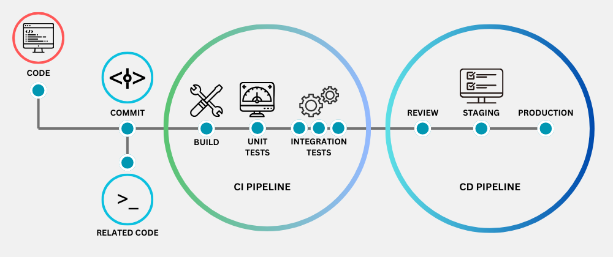
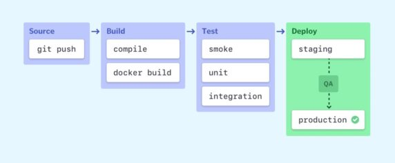
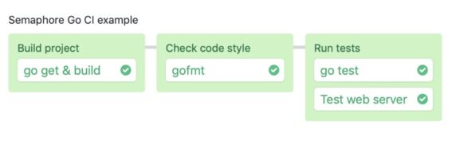
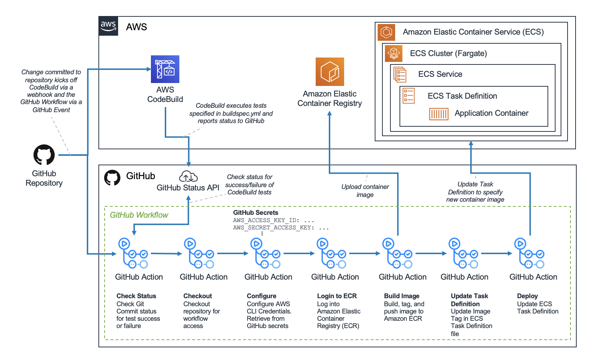

# Continuous Integration / Continuous Delivery/Deployment (CI/CD)
Set of DevOps practices **automating the software delivery process**
- From code changes to deployment
- Allows for **faster, more frequent, more reliable software releases** via...
- **Automated builds, tests, deployments**

**CI focuses on merging code often, while CD handles releasing that tested code...**
- **Manually (Delivery)**
- Or, **automatically (Deployment)**

CI/CD key advantages:
- Faster releases
- More frequent testing (so typically less bugs)
- Better collaboration and fast feedback loops
- Reduced risk due to smaller, more frequent changes (as opposed to large, infrequent changes)

# CI/CD Pipeline

### Continuous Integration (CI)
In practice, this means **developers merge code changes into main repo frequently**
- **Each merge triggers an automated build and test sequence**
    - Allows for quick fixes and a stable codebase

### Continuous Delivery (CD)
This is the **automation of the release of built and tested code**
- Automation means the **code is always in a deployable, production-ready state**
    - The final deployment to production may still require a manual approval

### Continuous Deployment (CD)
A step further than Delivery, this **automates the Deployment of every change that passes all stages of the pipeline to production**.
    - Release happens automatically
    - **Maximizes speed and efficiency** in getting newly developed features/fixes to users

## Common CI/CD Tools
**Gitlab CI/CD (CI/CD)**
- Built into GitLab repo ecosystem
- Auto DevOps templates, strong runner ecosystem
- Can have steep learning curve, runner management overhead balloons at scale

**Github Actions (CI/CD, tied to git workflows)**
- Integrated CI/CD within GitHub
    - Native, no need for separate server
- Marketplace of reusable actions, simple YAML workflows, strong branch/pull request triggers
- Less mature CD features, can become costly at scale

**Jenkins (CI + basic CD)**
- One of the oldest, most widely used open-source automation servers
    - Best when you need full control, customization, and open-source
- Flexible, thousands of plugins, technology-agnostic
- Somewhat outdated compared to modern tools, maintenance overhead, can be slow/brittle at scale

**AWS CodePipeline (CI/CD, AWS ecosystem)**
- Native integration with AWS ecosystem
    - Best choice for easy-setup end-to-end CI/CD for AWS-hosted applications
    - Integration with AWS CodeBuild/CodeDeploy (for reducing config complexity)
- Customizable pipelines with clearly defined stages and optional manual approvals
- Very scalable and AWS-level security
- AWS-limited, steep learning curve, very limited third-part integration (unlike Azure DevOps)
- Monitoring not as feature-rich as alternatives, especially as scale and complexity grows

**Azure DevOps (CI/CD, complete software dev lifecycle)**
- Supports complete software development lifesystem - CI/CD, version control, project management...
    - Encompasses Azure Pipelines, Boards, Repos, Test Plans
- Highly versatile (best suited for multi-platform pipelines)
    - Works with variety of cloud providers, OS, services...
- Deep third-party integration
    - Jenkins, GitHub, Docker, Kubernetes...
    - Azure, AWS...
- Very detailed control over dependencies, triggers, approvals, deployments...
- Advanced reporting/analytics
    - Monitor builds, deployments, pipeline health...
- Steep learning curve, complexity due to broadness and many tools
- Potential performance issues with large pipelines
- Complex pricing for advanced features
- Less thorough integration with AWS when compared to AWS-specific tools

## Example Pipelines (Complexity: Ascending Order)
   
**Outline**:
- **Source**: in most cases, a pipeline is triggered by a **change in code in the source code repo**
- **Build**: source code + dependencies used to **build runnable instance**
    - C/C++, Java, Go... **need to be compiled**
    - Python, JavaScript, Ruby... **can skip this step**
    - Regardless of language, **cloud-native software** is typically deployed with **Docker**
        - In this case, **Docker containers are built at this stage**
    - **Failure** at the Build stage is indicative with a fundamental problem with the project's config
- **Test**: **automated** (dev-written) **tests** are run to validate the updated code
    - **Depending on size/complexity**, this stage can last hours
    - Large-scale projects run tests in **multiple stages**:
        - Smoke tests: quick sanity checks
        - ...
        - Integration tests: tests the entire system from the user's point of view
    - These **extensive test suites are typically parallelized** to reduce run time
    - **Failure** at the Test stage reveals bugs in updated code; must provide feedback for devs quickly
- **Deploy**: usually **multiple deploy environments** - **beta/staging env** for internal use by product team + **production env** for end-users
    - Once the runnable instance of code has passed all tests, it's **ready for deployment**
    - **Agile: tests + real-time monitoring**
        - Usually **deploy WIP manually to a staging env** for **manual testing and review**
        - Then, **automatically deploy approved changes from master branch to production**
    

### Go

### GitHub, Jenkins, Nutanix Calm

### Amazon Elastic Container Service, GitHub Actions, AWS CodeBuild tests

### ...

